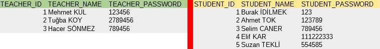
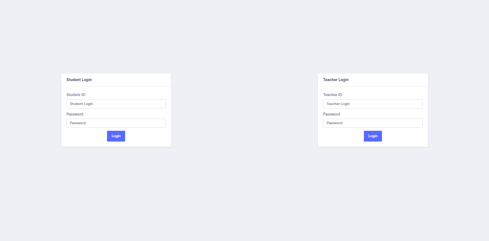
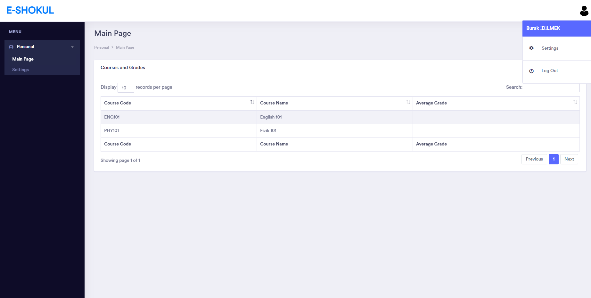
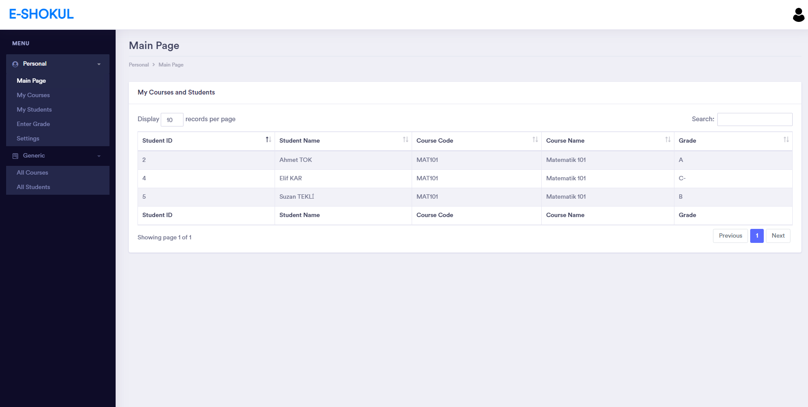

# School-Admin-Page
Very basic school admin website I did as homework while in college.

# How To Use
You can find the used database in `Database` folder. 
You must open index.php first. This will redirect you to login page.

## Login

 You can login with these information in login page 

## Student

 Student page to see taken courses and grades. The student can navigate through using left sidebar. Log out from clicking on the top right corner then press "Log out" button.

## Teacher

 Tacher page has much more capabilities than the student page.

# Capabilities
- Has 2 different login section: one for students and one for teachers.
- Students can;
  - see their grades
  - change password
- Teachers can;
  - grade students
  - add/remove courses
  - add/remove students to/from courses
  - see all students
  - see all courses
  - change password

# Page Structure
Every page has a left sidebar to navigate through the pages. In the top right corner we can see a profile icon, upon clicking it, a small window will open to access the settings page or log out.

# Website Structure
- Login
- Student
  - Personal
    - Main Page
    - Settings
- Teacher
  - Personal
    - Main Page
    - My Courses
    - My Students
    - Enter Grade
    - Settings
  - Generic
    - All Courses
    - All Students

### Disclaimer
I just added PHP over the website template, I don't remember the license of the template, use it with caution!
All the names used in database is made up turkish names except my name. It is possible that there is a person with the same name.
I translated this project to english from turkish in order to upload to Github. Unfortunately, I didn't translated database, therefore all the names in the database is turkish.
